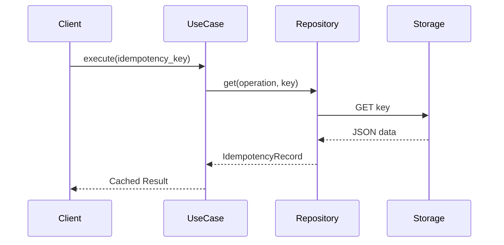
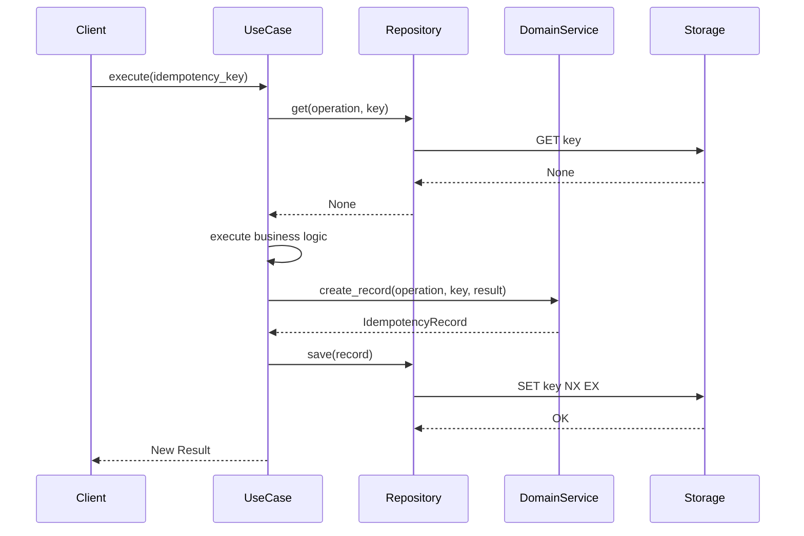
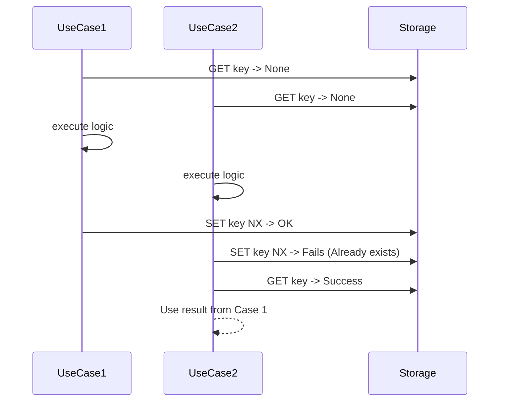

# Architecture

`idempotency-kit` follows the **Onion Architecture** (also known as Clean Architecture) to ensure maintainability, testability, and flexibility.

## Layers

### 1. Core Layer (`idempotency_kit.core`)
This is the innermost layer. It contains:
- **Entities**: Pure data models (`IdempotencyRecord`) representing the cached state.
- **Protocols**: Interface definitions (`AsyncIdempotencyRepository`, `IdempotencyMetricsProtocol`) that describe what infrastructure must provide.
- **Domain Services**: Business logic for creating and validating idempotency records (`IdempotencyDomainService`).
- **Exceptions**: Domain-specific error classes.

The core domain has **minimal dependencies** (Pydantic for models and validation). Infrastructure layer adds Redis integration via optional `[redis-aio]` extra and uses `orjson` for fast serialization.

### 2. Infrastructure Layer (`idempotency_kit.infra`)
This layer contains concrete implementations of the protocols defined in the Core layer.
- **Redis Storage**: `RedisAsyncIdempotencyRepository` implements the repository protocol using Redis as a backend.

## Dependency Rule
Dependencies always point inwards:
- `infra` depends on `core`.
- `core` has minimal external dependencies (Pydantic).

This allows testing the business logic in the `core` layer without needing a database or any other external service.

## Request Flow

### Successful Cache Hit



### Cache Miss and Save



### Concurrent Collision Scenario



## Error Handling Strategy

The library distinguishes between two types of "not found" scenarios:

1. **Cache Miss**: The record is genuinely not in the storage. This returns `None` (for `get`) or `{}` (for `get_many`).
2. **Storage Error**: Redis is unavailable or fails. This raises `IdempotencyStorageError`.

This distinction allows developers to decide whether to fail the request or proceed with at-least-once delivery (graceful degradation) when the idempotency layer is down.

## Bulk Operations and Redis Cluster

Bulk operations (`get_many`, `save_many`, `delete_many`) are designed to be efficient by using Redis `MGET` and non-transactional pipelines.

**Non-transactional pipelines** (`transaction=False`) are used for `save_many` to ensure compatibility with Redis Cluster. In a cluster environment, different keys can map to different hash slots, making standard `MULTI/EXEC` transactions impossible for arbitrary keys. By using a non-transactional pipeline, we send all commands in a single network round-trip while allowing them to be processed independently across different cluster nodes.

## Metrics and Observability

The library provides `IdempotencyMetricsProtocol` for observability:

- `record_hit` - cache hit
- `record_miss` - cache miss or not found
- `record_collision` - duplicate key on save
- `record_error` - storage/serialization error
- `record_latency` - operation duration
- `record_bulk_hit` - multiple hits in bulk operation
- `record_bulk_miss` - multiple misses in bulk operation

Wire metrics via repository constructor:

```python
repo = RedisAsyncIdempotencyRepository(redis, metrics=PrometheusMetrics())
```

The library follows the **Idempotency Key Pattern**:
1. Client provides a unique key for an operation.
2. Server checks if a result for this key is already cached.
3. If found, returns the cached result immediately.
4. If not found, executes the operation, caches the result, and returns it.

This ensures **at-most-once** or **exactly-once** semantics depending on how the application handles storage failures (see Graceful Degradation in User Guide).

## Redis Key Format

The `RedisAsyncIdempotencyRepository` uses the following format for keys:
`{key_prefix}{operation}:{idempotency_key}`

- `key_prefix`: Configurable (default: `idempotency:`).
- `operation`: Name of the operation (must not contain `:`).
- `idempotency_key`: Unique key provided by client (must not contain `:`).

By including the `operation` name in the key, the same `idempotency_key` can be reused across different operations without collisions.
