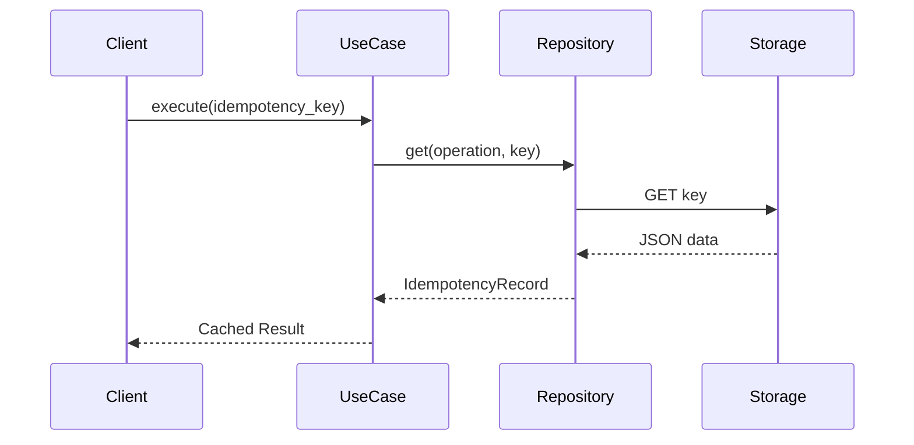
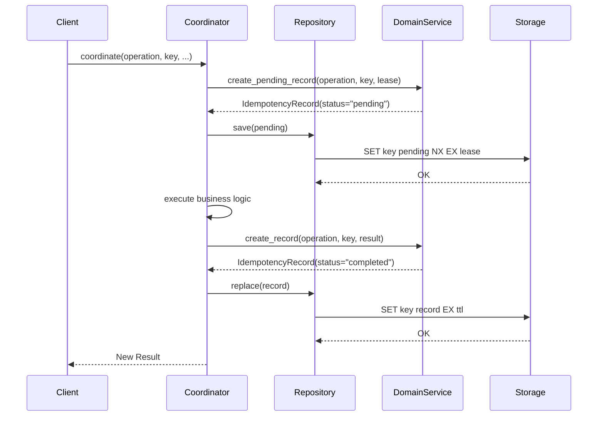
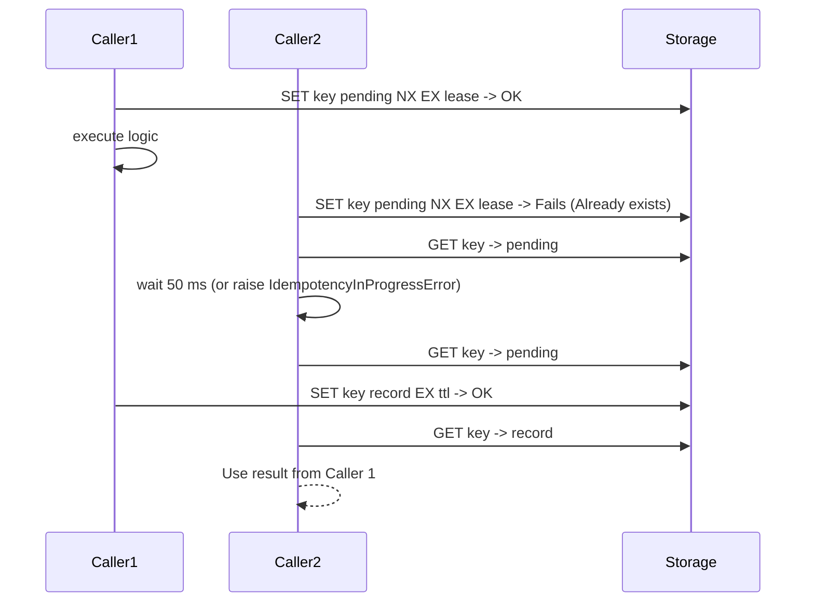
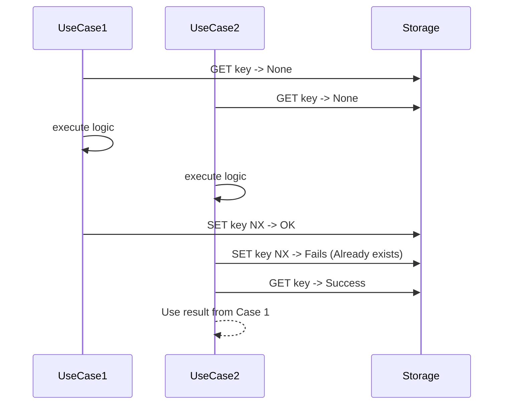

# Architecture

`idempotency-kit` follows the **Onion Architecture** (also known as Clean Architecture) to ensure maintainability, testability, and flexibility.

## Layers

### 1. Core Layer (`idempotency_kit.core`)
This is the innermost layer. It contains:
- **Entities**: Pure data models (`IdempotencyRecord`) representing the cached state.
- **Protocols**: Interface definitions (`AsyncIdempotencyRepository`, `IdempotencyMetricsProtocol`) that describe what infrastructure must provide.
- **Domain Services**: Business logic for creating and validating idempotency records (`IdempotencyDomainService`).
- **Exceptions**: Domain-specific error classes.

The core domain has **minimal dependencies** (Pydantic for models and validation). Infrastructure layer adds Redis integration via optional `[redis]` extra and uses `orjson` for fast serialization.

### 2. Infrastructure Layer (`idempotency_kit.infra`)
This layer contains concrete implementations of the protocols defined in the Core layer.
- **Redis Storage**: `RedisAsyncIdempotencyRepository` implements the repository protocol using Redis as a backend.

## Dependency Rule
Dependencies always point inwards:
- `infra` depends on `core`.
- `core` has minimal external dependencies (Pydantic).

This allows testing the business logic in the `core` layer without needing a database or any other external service.

## Request Flow

### Successful Cache Hit


```mermaid
sequenceDiagram
    participant Client
    participant UseCase
    participant Repository
    participant Storage

    Client->>UseCase: execute(idempotency_key)
    UseCase->>Repository: get(operation, key)
    Repository->>Storage: GET key
    Storage-->>Repository: JSON data
    Repository-->>UseCase: IdempotencyRecord
    UseCase-->>Client: Cached Result
```

### Cache Miss: Reserve, Execute, Complete

The coordinator reserves the key before the action runs. The reservation is the record in
its pending state, written with `SET NX` and the in-flight lease as its TTL; the completed
record is written over it afterwards with a plain `SET`.


```mermaid
sequenceDiagram
    participant Client
    participant Coordinator
    participant Repository
    participant DomainService
    participant Storage

    Client->>Coordinator: coordinate(operation, key, ...)
    Coordinator->>DomainService: create_pending_record(operation, key, lease)
    DomainService-->>Coordinator: IdempotencyRecord(status="pending")
    Coordinator->>Repository: save(pending)
    Repository->>Storage: SET key pending NX EX lease
    Storage-->>Repository: OK

    Coordinator->>Coordinator: execute business logic
    Coordinator->>DomainService: create_record(operation, key, result)
    DomainService-->>Coordinator: IdempotencyRecord(status="completed")

    Coordinator->>Repository: replace(record)
    Repository->>Storage: SET key record EX ttl
    Storage-->>Repository: OK

    Coordinator-->>Client: New Result
```

When the reservation fails, the coordinator reads the key: a completed record is a hit and is
returned. An action that raises deletes its reservation, so the retry runs it again.

### Concurrent Callers

With `in_flight="wait"` (the default) the second caller finds the reservation and polls the
key until the first caller's record replaces it. With `in_flight="raise"` it raises
`IdempotencyInProgressError` as soon as it sees the reservation, which an HTTP layer maps to
409. Either way the action ran once.


```mermaid
sequenceDiagram
    participant Caller1
    participant Caller2
    participant Storage

    Caller1->>Storage: SET key pending NX EX lease -> OK
    Caller1->>Caller1: execute logic

    Caller2->>Storage: SET key pending NX EX lease -> Fails (Already exists)
    Caller2->>Storage: GET key -> pending
    Caller2->>Caller2: wait 50 ms (or raise IdempotencyInProgressError)
    Caller2->>Storage: GET key -> pending

    Caller1->>Storage: SET key record EX ttl -> OK
    Caller2->>Storage: GET key -> record
    Caller2-->>Caller2: Use result from Caller 1
```

The wait is bounded by the lease: a pending record past its lease counts as absent, so a
worker that crashed mid-action cannot hold the key for longer, and a waiter that has spent a
whole lease raises `IdempotencyInProgressError` rather than waiting forever. The other side of
that bound is that the lease has to outlive the action; a reservation that expires mid-run
lets the next caller run the action again.

### Concurrent Callers with `in_flight="run"`

The flow from before reservations existed, for actions that are safe to repeat: both callers
run the action, the loser's `SET NX` collides, and it adopts the winner's result.


```mermaid
sequenceDiagram
    participant UseCase1
    participant UseCase2
    participant Storage

    UseCase1->>Storage: GET key -> None
    UseCase2->>Storage: GET key -> None

    UseCase1->>UseCase1: execute logic
    UseCase2->>UseCase2: execute logic

    UseCase1->>Storage: SET key NX -> OK
    UseCase2->>Storage: SET key NX -> Fails (Already exists)

    UseCase2->>Storage: GET key -> Success
    UseCase2-->>UseCase2: Use result from Case 1
```

## Error Handling Strategy

The library distinguishes between two types of "not found" scenarios:

1. **Cache Miss**: The record is genuinely not in the storage. This returns `None` (for `get`) or `{}` (for `get_many`).
2. **Storage Error**: Redis is unavailable or fails. This raises `IdempotencyStorageError`.

This distinction allows developers to decide whether to fail the request or proceed with at-least-once delivery (graceful degradation) when the idempotency layer is down.

## Bulk Operations and Redis Cluster

Bulk operations (`get_many`, `save_many`, `delete_many`) are designed to be efficient by using Redis `MGET` and non-transactional pipelines.

**Non-transactional pipelines** (`transaction=False`) are used for `save_many` to ensure compatibility with Redis Cluster. In a cluster environment, different keys can map to different hash slots, making standard `MULTI/EXEC` transactions impossible for arbitrary keys. By using a non-transactional pipeline, we send all commands in a single network round-trip while allowing them to be processed independently across different cluster nodes.

## Metrics and Observability

The library provides `IdempotencyMetricsProtocol` for observability:

- `record_hit` - cache hit
- `record_miss` - cache miss or not found
- `record_collision` - two callers on one key at the same time: the second one found a reservation, or (`in_flight="run"`) its save collided
- `record_error` - storage/serialization error
- `record_latency` - operation duration
- `record_bulk_hit` - multiple hits in bulk operation
- `record_bulk_miss` - multiple misses in bulk operation

Each metric has one owner, so a single collector can be handed to both layers without
double counting: the coordinator records hit, miss, collision and the latency of `get`,
`reserve` and `save`; the repository records errors, the bulk hit and miss counts of
`get_many`, and the latency of `delete` and `get_many`.

```python
metrics = PrometheusMetrics()
repo = RedisAsyncIdempotencyRepository(redis, metrics=metrics)
coordinator = AsyncIdempotencyCoordinator(repo, IdempotencyDomainService(), metrics=metrics)
```

The library follows the **Idempotency Key Pattern**:
1. Client provides a unique key for an operation.
2. Server reserves the key; if the key is already taken, it returns the stored result, or waits for the caller that holds it.
3. If the reservation succeeds, it executes the operation, writes the result over the reservation, and returns it.

What this gives is one execution per key while storage is up and the action finishes within
its lease, and at-least-once when storage is down, because the coordinator then runs the
action unreserved rather than failing the request (see Graceful Degradation in the User
Guide). It is not exactly-once: the reservation is a lease, not a lock.

## Redis Key Format

The `RedisAsyncIdempotencyRepository` uses the following format for keys:
`{key_prefix}{operation}:{idempotency_key}`

- `key_prefix`: Configurable (default: `idempotency:`).
- `operation`: Name of the operation (must not contain `:`).
- `idempotency_key`: Unique key provided by client (must not contain `:`).

By including the `operation` name in the key, the same `idempotency_key` can be reused across different operations without collisions.
